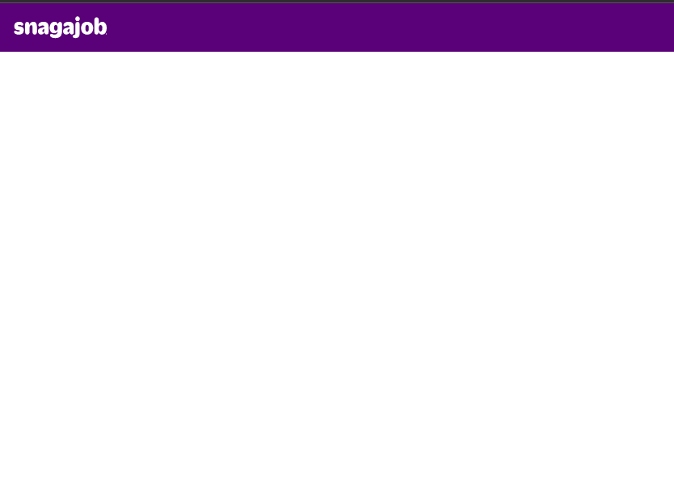

# Step 1: Application Shell 

## Initial App

1. Setup angular

   `ng new app --style css --routing true`

2. Add PWA support

   `ng add @angular/pwa`

3. Edit `index.html` and replace Angular icons with Snagajob icons. (copy from live website to `assets/icons`)

    - https://www.snagajob.com/v2assets/saj/favicons/favicon.ico
    - https://www.snagajob.com/v2assets/images/icons/icon.png
    - https://www.snagajob.com/v2assets/images/icons/icon_ios.png

4. Add icon links tp `index.html`

    ```HTML
    <link rel="icon" type="image/x-icon" href="assets/icons/favicon.ico">
    <link rel="icon" sizes="192x192" href="assets/icons/icon.png">
    <link rel="apple-touch-icon" href="assets/icons/icon_ios.png">
    ```

5. Set the theme-color to `#2d2873`

6. Move CSS from `index.html` to `style.css`

7. In `style.css`, define root variables with Snagajob purple color to start.

    ```CSS
    :root {
        --snagajob-purple: #4c2d79;
    }
    ```


8. In `style.css`, replace references to Angular blue with snagajob-purple

    e.g. 

    ```CSS
    background-color: var(--snagajob-purple);
    ```

9. In `app.component.html`, make the following edits:

   - Replace the Angular header icon. (Copy `https://www.snagajob.com/v2assets/brand/images/snagajob-white.svg` to `asssets/images/snagajob-white.svg`)
   - Delete Twitter and Youtube icons from app header
   - Delete contents of the #main and footer elements

10. `app.component.html` should now look like this:

    ```HTML
    <div class="toolbar" role="banner">
    
   

    <div class="content" role="main"></div>

    <footer></footer>
     </div>

    <router-outlet></router-outlet>

    ```

11. Start the local server:

    - Execute `ng serve` 
    - Open a browser to `http://localhost:4200/`


12. The Application Shell should look like this:

    